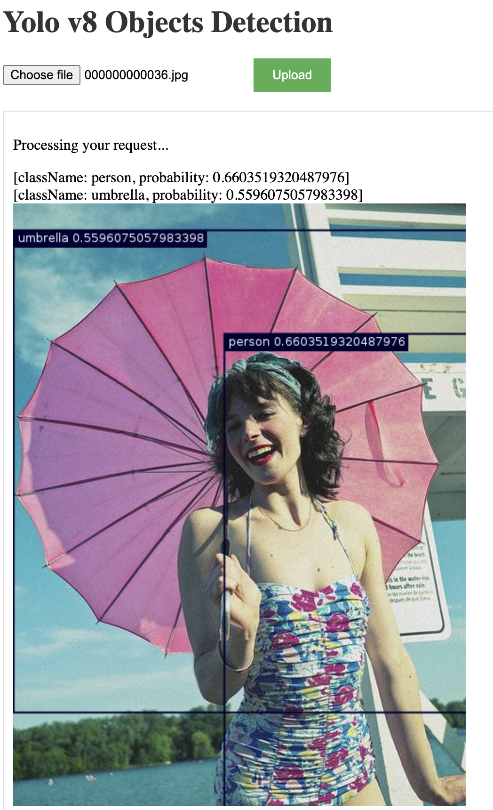

# Yolov8 Server for detection objects.

- Java 10+
- [YoloV8](https://github.com/ultralytics/ultralytics) pretrained model.
- Open source [ai.djl ](https://djl.ai/) library to build and deploy DL in Java.
- [Spring Boot](https://spring.io/projects/spring-boot) for creating REST API application.
- [Docker container](https://www.docker.com/resources/what-container/).

## <div align="center">Documentation</div>

See below for a quickstart installation and usage example.

<details open>
<summary>Install</summary>

1. You need to have or [install](https://docs.docker.com/engine/install/) Docker Engine.
2. Clone this repository:
    ```bash
    git clone git@github.com:SheepIsland/YOLOv8.git
    ```
3. Build the Docker image:

   Open a terminal or command prompt, navigate to the root directory of yolov8 project (where the Dockerfile is located), and run the following command:
     ```bash
    docker build -t yolov8 . --platform linux/amd64
    ```
4.  Run the Docker container: 
    
    After the Docker image is built successfully, you can run a container from it using the following command:
    ```bash
     docker run --platform linux/amd64 -p 8080:8080 yolov8
    ```

</details>

<details open>
<summary>Usage</summary>

Go to http://localhost:8080 and upload an image.


</details>


